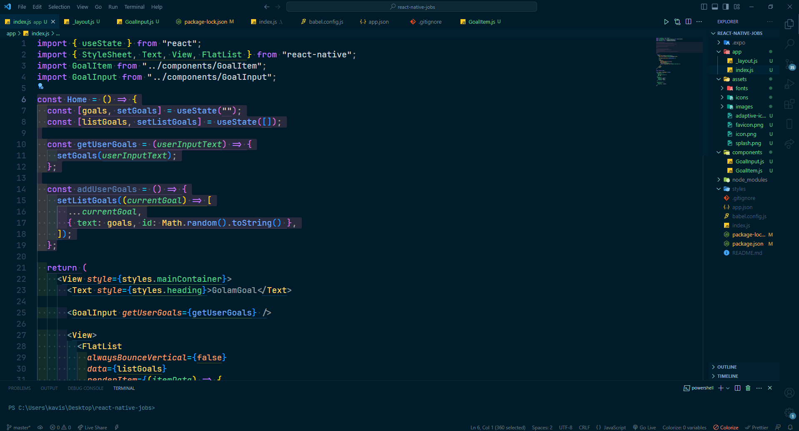

# [Oceanic-Depths](https://marketplace.visualstudio.com/items?itemName=LokeshKavisth.darkroom)

## [GitHub Repo](https://github.com/lokeshkavisth/darkroom)

The Oceanic Depths VSCode theme is a beautiful and soothing theme that is perfect for those who want to code in style. Inspired by the colors of the ocean, this theme uses a dark color scheme that features shades of blue and green to create a calming and relaxing atmosphere.

## SCREENSHOTS



## Donation

If you like this Theme, you could donate via **[PayPal](https://www.paypal.me/lokeshkavisth)** It will encourage me to make this Theme better and better!

### Suggest Editor Settings

```
 "editor.fontSize": 20,
 "editor.lineHeight": 30,
 "editor.fontFamily": "JetBrains Mono",
```

JetBrains Mono Download: https://www.jetbrains.com/lp/mono

### Tweaks & theming

If you want to play around with new colors, use the setting
`workbench.colorCustomizations` to customize the currently selected theme. For
example, you can add this snippet in your "settings.json" file:

```json
"workbench.colorCustomizations": {
  "tab.activeBackground": "#495f77",
  "activityBar.background": "#002636",
  "sideBar.background": "#001b29",
  "tab.activeBorder": "#0082e2",
}
```

[more info](https://code.visualstudio.com/api/references/theme-color)

## For more information

- [Twitter](http://twitter.com/lokeshkavisth)

**Enjoy!**
